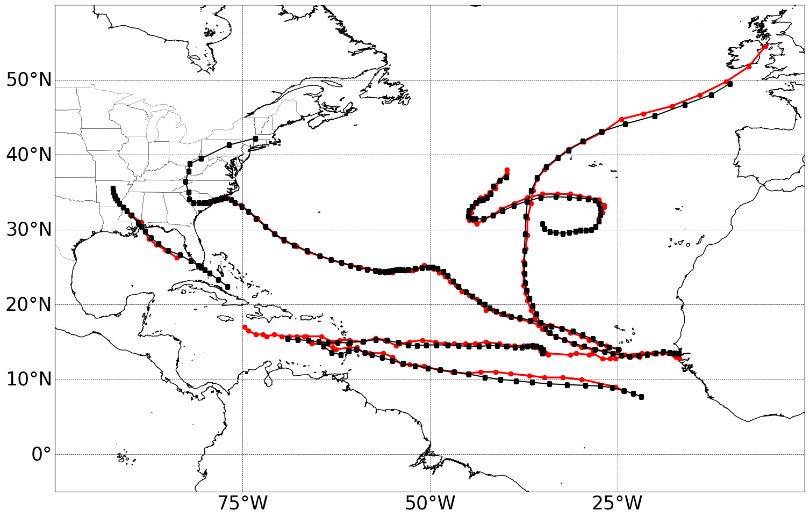

# Testing CyTRACK
## Steps

1 - You can check the reproducible CyTRACK capsule in Code Ocean

[](https://doi.org/10.24433/CO.9578727.v1)

OR

1 - After install CyTRACK, manually run the testing example on your local PC. 

* Clone the CyTRACK repository.

 ```
git clone https://github.com/apalarcon/CyTRACK.git
  ```

* Go to CyTRACK/testing_CyTRACK directory
```
cd  CyTRACK/testing_CyTRACK
```
* Create the directory ```data/ERA5_data```
```
mkdir -p data/ERA5_data
```
* The input data is from the ERA5 reanalysis.
  
-- You can download the input data from [](https://doi.org/10.5281/zenodo.10767422) and copy it into ```data/ERA5_data```

or

-- CyTRACK will automatically download the required ERA5 input data. Therefore, be sure you have installed and correctly configured the python CDS API (cdsapi) for data downloading (see <a href="https://cds.climate.copernicus.eu/api-how-to" target="blank"> How to use the CDS API - Climate Data Store - Copernicus </a>).

* Run the testing_CyTRACK.sh script

```
sh testing_CyTRACK.sh
```
### Important Note
1 - The example is for tracking tropical cyclones in September 2018 in the North Atlantic basin. It is also important to remark that some tropical cyclones in the eastern Pacific Ocean can be also capture by CyTRACK.

## Testing Results
1 - If CyTRACK runs successfully, the CyTRACK_output directory should be created. In this directory, you should find the following file ```CyTRACK_output/CyTRACK_AL_2018090100-2018093018_ERA5_TC.dat```, containing the information on the identified tropical cyclones.

2 - To plot the cyclones tracks, run the ```plotting_test_CyTRACK_outputs.py``` script. As the North Atlantic is the target basin, this script removed for plotting cyclones that formed over the eastern Pacific Ocean.
```
python plotting_test_CyTRACK_outputs.py
```
3 - You should obtain the following map. Red tracks are from CyTRACK  and black tracks from HURDAT2


